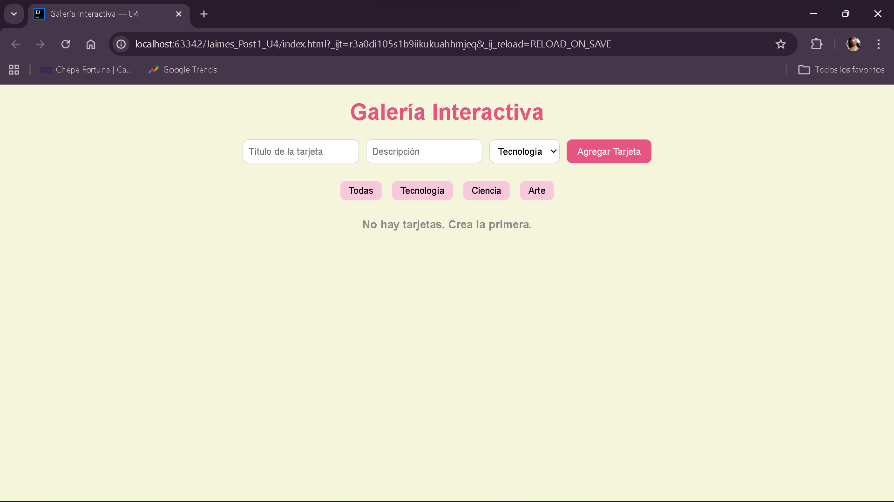
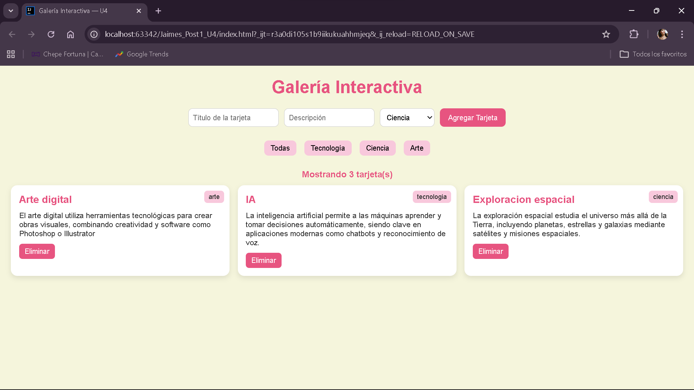
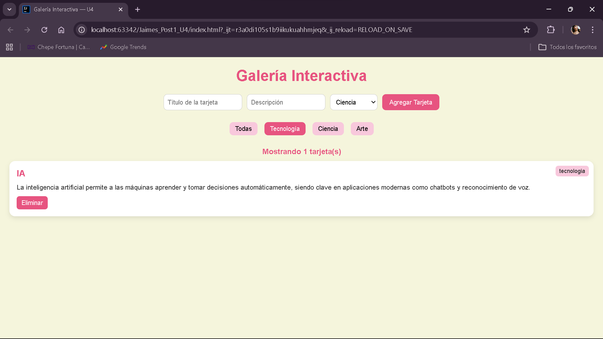
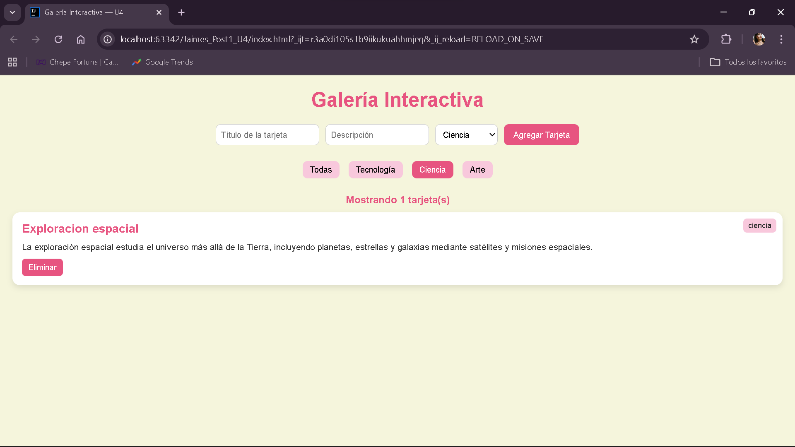
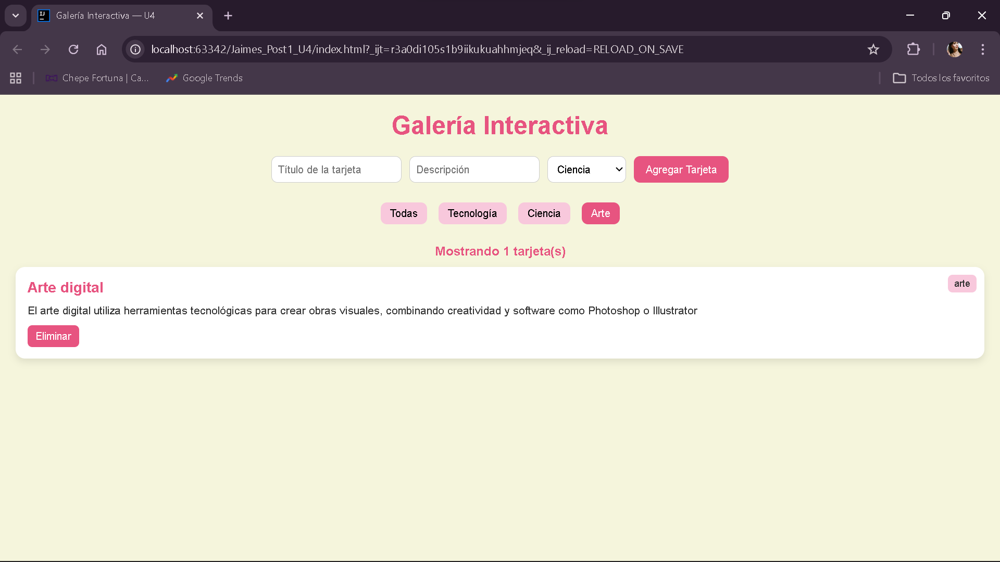
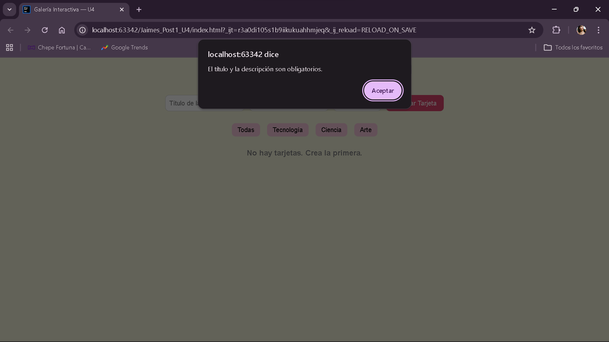

Galería Interactiva — Unidad 4

Nombre: Oriana Jaimes

Codigo: 02220131047

Descripción del Proyecto

Este proyecto consiste en una galería interactiva de tarjetas
desarrollada con JavaScript puro (Vanilla JS), que permite
crear, filtrar y eliminar tarjetas dinámicamente

El objetivo principal es aplicar conceptos fundamentales de:

1. Manipulación del DOM
2. Manejo de eventos
3. Programación en JavaScript ES6

Cada tarjeta contiene un título, descripción y categoría, 
y puede ser gestionada directamente desde la interfaz

Funcionalidades:

1. Crear tarjetas dinámicamente
2. Eliminar tarjetas 
3. Filtrar por categoría (Tecnología, Ciencia, Arte)
4. Contador de tarjetas visibles
5. Mensaje cuando la galería está vacía

Instrucciones de Ejecución

1. Clonar el repositorio
2. Abrir la carpeta del proyecto
3. Abrir el proyecto en tu editor de codigo

4. Ejecutar con Live Server:

- Clic derecho en `index.html`
- Seleccionar tu navegador

Tecnologías Utilizadas

HTML5: estructura del proyecto
CSS3: estilos y diseño
JavaScript (ES6): lógica y funcionalidad
DOM API: manipulación de elementos
Git & GitHub control de versiones

Capturas de Pantalla

Vista principal

Tarjetas creadas

Filtro por categoría

Filtro 1

Filtro 2

Filtro 3

Mensaje de galería vacía

